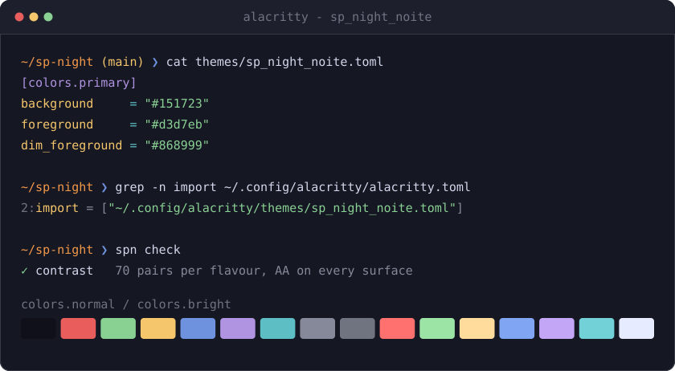
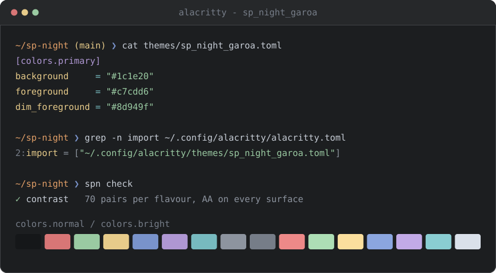
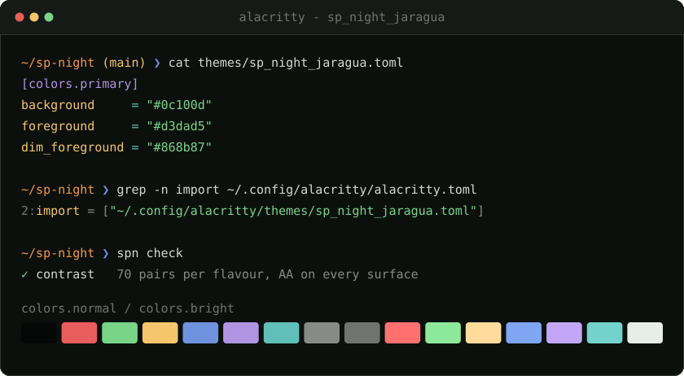

<p align="center">
  <a href="https://sp-night.github.io">
    
  </a>
</p>

<h1 align="center">SP Night for <a href="https://alacritty.org/">Alacritty</a></h1>

<p align="center">
  <strong>The sodium lamp turns the whole city this colour.</strong><br>
  A dark colour scheme with São Paulo as its reference — the sodium street lamp,<br>
  exposed concrete, the free span of the MASP, the drizzle before the rain.
</p>

<p align="center">
  <a href="https://sp-night.github.io"><strong>sp-night.github.io</strong></a>
  &nbsp;·&nbsp;
  <a href="https://sp-night.github.io/palette">palette</a>
  &nbsp;·&nbsp;
  <a href="https://sp-night.github.io/spec">spec</a>
  &nbsp;·&nbsp;
  <a href="https://sp-night.github.io/ports">ports</a>
</p>

---

## The flavours

All three are dark, by decision. The previews below are synthetic — drawn from the
palette itself, so they can never drift from what you install.

### Noite Paulista — `sp_night_noite.toml`

The city at 3am. Blue-violet dark, the sodium lamp burning warm on top.



### Garoa — `sp_night_garoa.toml`

The same window, seen through the drizzle. Flat grey — the garoa does not cool
the city down, it washes it out.



### Pico do Jaraguá — `sp_night_jaragua.toml`

The same night, seen from the city's highest point. Near-black surfaces, with
the forest left to the accents — and the red-and-white tower lit at the summit.



## Install

Alacritty imports a theme from its own config, so the file sits beside
`alacritty.toml` and nothing overwrites it. The config format has been
[TOML since 0.13](https://github.com/alacritty/alacritty/blob/master/CHANGELOG.md).

Grab the flavour you want (or all three):

```sh
mkdir -p ~/.config/alacritty/themes
curl -Lo ~/.config/alacritty/themes/sp_night_noite.toml \
  https://raw.githubusercontent.com/sp-night/alacritty/main/themes/sp_night_noite.toml
```

Then import it from `~/.config/alacritty/alacritty.toml`:

```toml
[general]
import = ["~/.config/alacritty/themes/sp_night_noite.toml"]
```

Alacritty watches its configuration and reloads on save, so the colours
change as you write the file. If yours does not, set
`general.live_config_reload = true`.

> [!NOTE]
> `import` lived at the top level until Alacritty 0.14 moved it into
> `[general]`. On 0.13, drop the `[general]` header and keep the bare
> `import = [...]`. TOML reads a bare key as belonging to whatever table
> precedes it, so it has to come before every `[...]` header in the file.

Prefer a checkout? Clone and copy, the files are plain text and there is no build:

```sh
git clone https://github.com/sp-night/alacritty.git
cp alacritty/themes/*.toml ~/.config/alacritty/themes/
```

Three keys the theme deliberately leaves alone, all for one reason: this
project does not ship a colour nobody measured.

`[colors.dim]` is absent. The palette's bright ladder covers the six ANSI
accents and stops there, so there is no measured dim set to write, and
Alacritty derives faint text on its own.

`primary.bright_foreground` is absent. The role layer has no colour above
`ui.fg` for text, and Alacritty falls back to `foreground`, which is the
value that key would have carried anyway.

`draw_bold_text_with_bright_colors` is absent because it is behaviour
rather than colour. Set it in your own config if you want bold text to use
`[colors.bright]`; the theme will not decide that for you.

## What gets themed

| Alacritty key | Role | Meaning |
|---|---|---|
| `colors.normal.*` / `colors.bright.*` | `ansi.*` | the full 16-colour ANSI mapping |
| `colors.primary.background` / `.foreground` | `ui.bg` / `ui.fg` | *laje* under the main text |
| `colors.primary.dim_foreground` | `ui.fg_dim` | faint text recedes to the measured dim, not to a multiplier |
| `colors.cursor.cursor` / `.text` | `ui.cursor` / `ui.on_accent` | the *sódio* cursor, dark text inside it |
| `colors.vi_mode_cursor.cursor` / `.text` | `ui.accent_alt` / `ui.on_accent` | vi mode is a different mode, so the cursor changes hue rather than brightness |
| `colors.selection.background` / `.text` | `ui.selection` / `ui.fg` | *vidro*, glass reflecting the street |
| `colors.search.matches` | `ui.match` / `ui.on_accent` | every hit in *táxi*, the colour this theme uses for a match |
| `colors.search.focused_match` | `ui.accent` / `ui.on_accent` | the hit you are on takes the signature colour, so the cursor is never lost in the crowd |
| `colors.hints.start` / `.end` | `ui.accent` / `ui.panel` | the key to press next is loud, the rest of the label stays concrete |
| `colors.footer_bar` | `ui.panel` / `ui.fg` | the search prompt and URI preview sit on exposed concrete |
| `colors.line_indicator` | `ui.bg_deep` / `ui.fg_dim` | the position readout recedes into the *vão* |

No hex in this repo was picked by hand. Every value comes from the
[SP Night palette](https://sp-night.github.io/palette) through its role layer,
both published as data:
[`palette.json`](https://sp-night.github.io/palette.json) and
[`roles.json`](https://sp-night.github.io/roles.json). The contrast floors those
colours have to clear are [written down in the spec](https://sp-night.github.io/spec)
and enforced in CI.

## The mapping

[`alacritty.toml.tmpl`](alacritty.toml.tmpl) is the full record of which Alacritty key means which
role — the table above in complete form. The files in
[`themes/`](themes) are what it resolves to, one per flavour.

You never need it to use the theme: the shipped files are plain text and final.
It is here so the mapping survives, and so a retuned palette can be rolled
through this port without anyone re-deciding which colour the focused search hit takes.

## License

[MIT](LICENSE)
